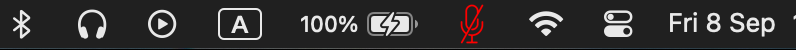
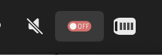

# MicStatus
 
 Mic Status is a macOS menu bar application that allows you to quickly understand the current status of your microphone un/muted.

## Features

- Intuitive menu bar icon that changes to reflect the microphone's status.
- You can enable and disable monitoring of the microphone status.
- Lightweight and unobtrusive design.

## Getting Started

To get started with Mic Status, follow these steps:

1. [Download the latest release](https://github.com/Disconnecter/MicStatus/releases/latest).
2. Extract the downloaded ZIP file.
3. Drag the "MicStatus.app" to your Applications folder.
4. Run Mic Status from your Applications folder.

## Usage

- The icon will change to indicate the microphone's status (muted/unmuted).
- Install [this](https://github.com/raycast/script-commands/blob/master/commands/system/audio/toggle-mic.applescript) apple [script](https://support.apple.com/en-jo/guide/script-editor/scpe037c22c8/mac)
- Add [hotkey](https://apple.stackexchange.com/questions/175215/how-do-i-assign-a-keyboard-shortcut-to-an-applescript-i-wrote) for new apple script

## Development

If you want to build and run Mic Status from the source code:

1. Clone this repository to your local machine.
2. Open the Xcode project.
3. Build and run the project in Xcode.

## Support and Feedback

If you encounter any issues, have suggestions, or would like to contribute to this project, please [open an issue](https://github.com/Disconnecter/MicStatus/issues) on GitHub.

## License

This project is licensed under the [MIT License](LICENSE).

Enjoy using Mic Status!
